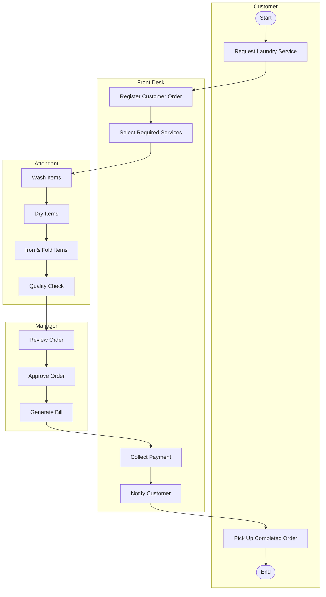
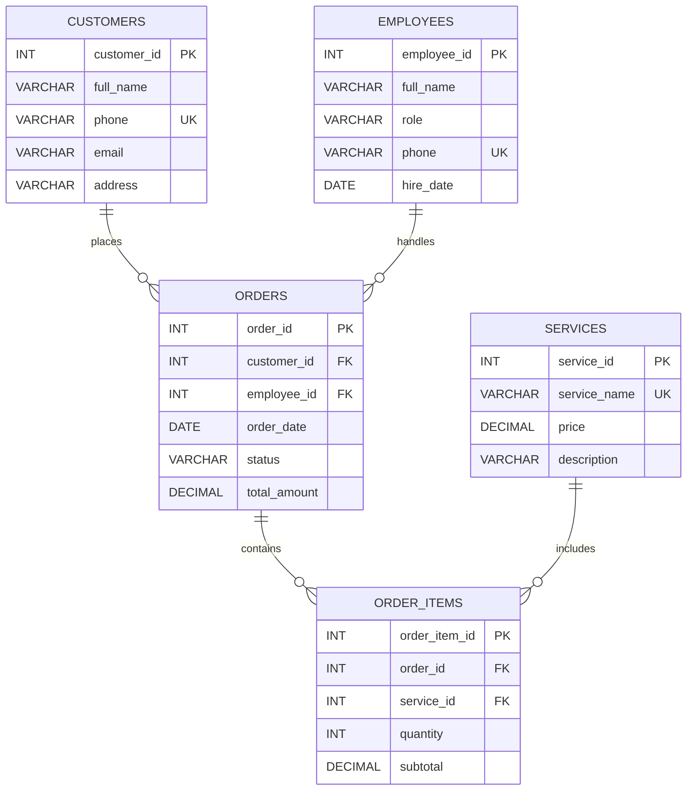

[README (1).md](https://github.com/user-attachments/files/30497386/README.1.md)
# Laundry Management System — Oracle Database Project

## Project Information

| **Field** | **Details** |
|------------|-------------|
| **Course** | Database Programming |
| **Institution** | University of Lay Adventists of Kigali (UNILAK) |
| **Student** | G. Uriah Summerville, Jr |
| **Registration Number** | 28873/2025 |
| **Submission Date** | Thursday, July 30, 2026 |

---

## 1. Overview

The Laundry Management System (LMS) is an Oracle-based database application that digitizes the daily operations of a laundry business — from order intake to payment and pickup. It replaces the manual, paper-based registers used by small and medium laundry shops with a centralized, reliable, query-able Oracle database.

The project was built in nine progressive phases, from business process modeling through logical design, physical implementation, PL/SQL programming, and advanced security/auditing.

**Technologies used:** Oracle Database, SQL\*Plus / SQL Developer, PL/SQL (procedures, functions, packages, triggers).

---

## 2. Problem Statement

**Context of use:** "Many Laundry shop currently records customer orders, service prices, and payments by hand in notebooks. This causes lost order slips, incorrect billing, no visibility into which attendant is handling which order, and no historical record for decision-making.

**Target users**
- Shop Manager — oversees operations & reports
- Front-Desk Officer — registers orders & payments
- Laundry Attendants — process & wash items
- Customers — receive accurate, fast service

**Project objectives**
- Centralize customer & order data in Oracle
- Track order status from drop-off to pickup
- Automate pricing & billing calculations
- Enforce data integrity and secure access
- Provide an audit trail of all data changes

**Expected benefits**
- Faster, error-free order processing
- Real-time tracking of laundry status
- Accurate, transparent billing for customers
- Reliable records for audits & performance review
- Reduced fraud via activity logging

---

## 3. Business Process Modeling

**System scope:** order intake → service selection → washing → quality check → payment → pickup.

**Actors:** Customer, Front-Desk Officer, Laundry Attendant, Manager (approvals & reports).

**Workflow (BPMN-style swimlane, start → end):**

| Lane | Step |
|---|---|
| Customer | Request Service |
| Front Desk | Register Order & Select Services |
| Attendant | Wash / Dry / Iron Items |
| Attendant | Quality Check |
| Manager | Approve & Generate Bill |
| Front Desk | Collect Payment & Notify Customer |
| Customer | Pickup Order |

A customer requests service; the front-desk officer registers the order in `ORDERS` / `ORDER_ITEMS`; attendants wash and quality-check items; the manager approves the bill; the front desk collects payment and the customer picks up the order. The full swimlane diagram (four lanes, connected process boxes) is on slide 4 of the accompanying PowerPoint.

## Business Process Workflow (BPMN-Style Swimlanes)



---

## 4. Logical Database Design (5 tables, 3NF)

### Entities, attributes, and keys

| Table | Columns | Keys |
|---|---|---|
| **CUSTOMERS** | customer_id, full_name, phone (UQ), email, address | PK: customer_id |
| **EMPLOYEES** | employee_id, full_name, role, phone (UQ), hire_date | PK: employee_id |
| **SERVICES** | service_id, service_name (UQ), price, description | PK: service_id |
| **ORDERS** | order_id, customer_id, employee_id, order_date, status, total_amount | PK: order_id · FK: customer_id → CUSTOMERS · FK: employee_id → EMPLOYEES |
| **ORDER_ITEMS** | order_item_id, order_id, service_id, quantity, subtotal | PK: order_item_id · FK: order_id → ORDERS · FK: service_id → SERVICES |

### Relationships
- CUSTOMERS 1 : M ORDERS
- EMPLOYEES 1 : M ORDERS
- ORDERS 1 : M ORDER_ITEMS
- SERVICES 1 : M ORDER_ITEMS

### Normalization to 3NF
- **1NF** — all attributes are atomic (no repeating groups or multi-valued fields).
- **2NF** — every table uses a single-column surrogate primary key, so there is no partial dependency on part of a composite key.
- **3NF** — no transitive dependencies; `total_amount` is a maintained/derived value (kept in sync by a trigger, see Phase VIII) rather than a functional dependency of another non-key attribute.

- ## Entity Relationship Diagram (ERD)



### Normalization (3NF)

- **First Normal Form (1NF):** All attributes are atomic with no repeating groups.
- **Second Normal Form (2NF):** Every table uses a single-column surrogate primary key, eliminating partial dependencies.
- **Third Normal Form (3NF):** No non-key attribute depends on another non-key attribute. The `total_amount` in the **ORDERS** table is maintained as a derived value and does not introduce a transitive dependency.

---
**Laundry Management System** • **Database Programming** • **University of Lay Adventists of Kigali (UNILAK)**

---

## 5. Database Creation

```sql
-- Create dedicated application schema/user
CREATE USER laundry_admin
  IDENTIFIED BY "Laundry#2026"
  DEFAULT TABLESPACE users
  TEMPORARY TABLESPACE temp
  QUOTA UNLIMITED ON users;

-- Assign least-privilege access
GRANT CREATE SESSION, CREATE TABLE,
      CREATE VIEW, CREATE PROCEDURE,
      CREATE TRIGGER, CREATE SEQUENCE
  TO laundry_admin;

-- Configure access (SQL*Plus)
CONNECT laundry_admin/Laundry#2026@orclpdb
```

**Naming convention**
- Tables: plural `UPPER_SNAKE_CASE` — e.g. `CUSTOMERS`, `ORDERS`
- Primary keys: `<table_singular>_id` — e.g. `customer_id`
- Foreign keys: `fk_<child>_<parent>` — e.g. `fk_orders_customers`
- Constraints: `pk_` / `fk_` / `uq_` / `ck_` prefix by type
- Triggers: `trg_<table>_<purpose>`

**Access configuration**
- Application role `LMS_APP` created; end-user accounts are granted the role, not direct object privileges.
- Front-desk & attendant accounts are restricted to DML only (no DDL) on business tables.
- Manager account is additionally granted `SELECT` on `AUDIT_LOG` for oversight.

---

## 6. Table Creation & Implementation

```sql
CREATE TABLE customers (
  customer_id NUMBER GENERATED ALWAYS AS IDENTITY
              PRIMARY KEY,
  full_name  VARCHAR2(80)  NOT NULL,
  phone      VARCHAR2(15)  NOT NULL UNIQUE,
  email      VARCHAR2(100),
  address    VARCHAR2(150));

CREATE TABLE employees (
  employee_id NUMBER GENERATED ALWAYS AS IDENTITY
              PRIMARY KEY,
  full_name  VARCHAR2(80) NOT NULL,
  role       VARCHAR2(20) NOT NULL
     CHECK (role IN ('MANAGER','ATTENDANT',
                      'WASHER','CASHIER')),
  phone      VARCHAR2(15) UNIQUE,
  hire_date  DATE DEFAULT SYSDATE NOT NULL);

CREATE TABLE services (
  service_id   NUMBER GENERATED ALWAYS AS IDENTITY
               PRIMARY KEY,
  service_name VARCHAR2(50) NOT NULL UNIQUE,
  price        NUMBER(8,2)  NOT NULL CHECK (price > 0),
  description  VARCHAR2(200));

CREATE TABLE orders (
  order_id    NUMBER GENERATED ALWAYS AS IDENTITY
              PRIMARY KEY,
  customer_id NUMBER NOT NULL,
  employee_id NUMBER NOT NULL,
  order_date  DATE DEFAULT SYSDATE NOT NULL,
  status      VARCHAR2(20) DEFAULT 'PENDING'
     CHECK (status IN ('PENDING','WASHING','READY',
                        'COMPLETED','CANCELLED')),
  total_amount NUMBER(10,2) DEFAULT 0
     CHECK (total_amount >= 0),
  CONSTRAINT fk_orders_customers FOREIGN KEY(customer_id)
     REFERENCES customers(customer_id),
  CONSTRAINT fk_orders_employees FOREIGN KEY(employee_id)
     REFERENCES employees(employee_id));

CREATE TABLE order_items (
  order_item_id NUMBER GENERATED ALWAYS AS IDENTITY
                PRIMARY KEY,
  order_id   NUMBER NOT NULL,
  service_id NUMBER NOT NULL,
  quantity   NUMBER(4) NOT NULL CHECK (quantity > 0),
  subtotal   NUMBER(10,2) NOT NULL,
  CONSTRAINT fk_items_orders FOREIGN KEY(order_id)
     REFERENCES orders(order_id) ON DELETE CASCADE,
  CONSTRAINT fk_items_services FOREIGN KEY(service_id)
     REFERENCES services(service_id));
```

### Sample data

```sql
INSERT INTO customers (full_name, phone, email)
VALUES ('Aline Uwase','0788123456','aline@mail.com');

INSERT INTO employees (full_name, role)
VALUES ('Eric Niyonzima','ATTENDANT');

INSERT INTO services (service_name, price)
VALUES ('Wash & Fold', 1500);

INSERT INTO orders (customer_id, employee_id)
VALUES (1, 1);

INSERT INTO order_items (order_id, service_id, quantity, subtotal)
VALUES (1, 1, 3, 4500);

COMMIT;
```

Data integrity is enforced through `NOT NULL`, `UNIQUE`, `CHECK`, and `FOREIGN KEY` constraints on every table, so invalid rows (negative prices, unknown status values, orphaned order items, etc.) are rejected at the database level.

---

## 7. PL/SQL Programming

```sql
-- Package specification
CREATE OR REPLACE PACKAGE pkg_laundry AS
  PROCEDURE add_order_item(p_order_id NUMBER,
     p_service_id NUMBER, p_qty NUMBER);
  FUNCTION  get_order_total(p_order_id NUMBER)
     RETURN NUMBER;
END pkg_laundry;
/

-- Package body: procedure, function, exceptions, COMMIT/ROLLBACK
CREATE OR REPLACE PACKAGE BODY pkg_laundry AS

  FUNCTION get_order_total(p_order_id NUMBER)
    RETURN NUMBER IS
    v_total NUMBER := 0;
  BEGIN
    SELECT NVL(SUM(subtotal),0) INTO v_total
      FROM order_items WHERE order_id = p_order_id;
    RETURN v_total;
  END;

  PROCEDURE add_order_item(p_order_id NUMBER,
      p_service_id NUMBER, p_qty NUMBER) IS
    v_price   services.price%TYPE;
    e_bad_qty EXCEPTION;
  BEGIN
    IF p_qty <= 0 THEN RAISE e_bad_qty; END IF;

    SELECT price INTO v_price FROM services
      WHERE service_id = p_service_id;

    INSERT INTO order_items(order_id, service_id, quantity, subtotal)
      VALUES(p_order_id, p_service_id, p_qty, v_price * p_qty);

    COMMIT;
  EXCEPTION
    WHEN e_bad_qty THEN
      ROLLBACK;
      RAISE_APPLICATION_ERROR(-20010,'Qty must be > 0');
    WHEN NO_DATA_FOUND THEN
      ROLLBACK;
      RAISE_APPLICATION_ERROR(-20011,'Invalid service');
  END;

END pkg_laundry;
/
```

This package demonstrates a **function** (`get_order_total`), a **procedure** with **DML** (`add_order_item`), **exception handling** (custom exception + `NO_DATA_FOUND`), and **transaction control** (`COMMIT` / `ROLLBACK`).

---

## 8. Advanced Database Programming

### Simple trigger — auto-maintain order total

```sql
CREATE OR REPLACE TRIGGER trg_items_total
AFTER INSERT OR UPDATE OR DELETE ON order_items
FOR EACH ROW
BEGIN
  UPDATE orders SET total_amount = (
    SELECT NVL(SUM(subtotal),0) FROM order_items
     WHERE order_id = NVL(:NEW.order_id,:OLD.order_id))
  WHERE order_id = NVL(:NEW.order_id,:OLD.order_id);
END;
/
```

### Reference & audit tables

```sql
CREATE TABLE public_holidays (
  holiday_date DATE PRIMARY KEY,
  description  VARCHAR2(100));

CREATE TABLE audit_log (
  audit_id   NUMBER GENERATED ALWAYS AS IDENTITY
             PRIMARY KEY,
  table_name VARCHAR2(30),
  action     VARCHAR2(10),
  record_id  NUMBER,
  changed_by VARCHAR2(30),
  changed_on DATE DEFAULT SYSDATE);
```

### Compound trigger — audit trail & user activity tracking

```sql
CREATE OR REPLACE TRIGGER trg_orders_audit
FOR INSERT OR UPDATE OR DELETE ON orders
COMPOUND TRIGGER
  TYPE t_ids IS TABLE OF NUMBER;
  g_ids t_ids := t_ids();

  AFTER EACH ROW IS
  BEGIN
    g_ids.EXTEND;
    g_ids(g_ids.COUNT) := NVL(:NEW.order_id,:OLD.order_id);
  END AFTER EACH ROW;

  AFTER STATEMENT IS
  BEGIN
    FOR i IN 1 .. g_ids.COUNT LOOP
      INSERT INTO audit_log(table_name, action, record_id, changed_by)
      VALUES ('ORDERS',
        CASE WHEN UPDATING THEN 'UPDATE'
             WHEN DELETING THEN 'DELETE' ELSE 'INSERT' END,
        g_ids(i), SYS_CONTEXT('USERENV','SESSION_USER'));
    END LOOP;
  END AFTER STATEMENT;
END trg_orders_audit;
/
```

### Security trigger — restrict writes to business days

```sql
CREATE OR REPLACE TRIGGER trg_orders_restrict
BEFORE INSERT OR UPDATE OR DELETE ON orders
FOR EACH ROW
DECLARE
  v_hol NUMBER;
BEGIN
  SELECT COUNT(*) INTO v_hol FROM public_holidays
   WHERE holiday_date = TRUNC(SYSDATE);

  IF TO_CHAR(SYSDATE,'DY') IN ('SAT','SUN') OR v_hol > 0 THEN
    RAISE_APPLICATION_ERROR(-20001,
      'Writes allowed Mon-Fri only (business days).');
  END IF;
END;
/
```

> **Note on business-day rule:** INSERT/UPDATE/DELETE on `ORDERS` is permitted Monday–Friday only. Writes are blocked on Saturdays, Sundays, and any date listed in `PUBLIC_HOLIDAYS`, enforcing a realistic weekday-only business policy for the shop.

---

## 9. Conclusion & References

**Conclusion**

The Laundry Management System demonstrates a complete Oracle database lifecycle — from business process modeling to a secure, audited, production-style implementation. A compact, normalized 5-table schema (`CUSTOMERS`, `EMPLOYEES`, `SERVICES`, `ORDERS`, `ORDER_ITEMS`) supports the full order-to-payment workflow while remaining easy to maintain. PL/SQL packages, triggers, and constraints enforce business rules automatically, reducing the manual errors seen in the original paper-based process. Compound triggers and the `AUDIT_LOG` / `PUBLIC_HOLIDAYS` reference tables add accountability and enforce weekday-only business operations. The system is realistic, scalable, and ready for extension (e.g. loyalty points, SMS notifications, multi-branch support).

**References**

- Oracle Corp., "Oracle Database SQL Language Reference," Oracle Help Center, 2024.
- Oracle Corp., "PL/SQL Language Reference," Oracle Help Center, 2024.
- Elmasri, R. & Navathe, S., *Fundamentals of Database Systems*, 7th ed., Pearson, 2016.
- Object Management Group, "Business Process Model and Notation (BPMN) 2.0," OMG, 2011.
- UNILAK, Database Programming Course Notes, 2026.

---

## 10. How to Run This Project

1. Connect as a DBA-privileged user and run the **Database Creation** script (Section 5) to create `laundry_admin`.
2. Connect as `laundry_admin` and run the **Table Creation** scripts (Section 6), followed by the sample `INSERT` statements.
3. Run the **PL/SQL package** (Section 7) to compile `pkg_laundry`.
4. Run the **triggers** and supporting tables (Section 8) — create `public_holidays` and `audit_log` first, then compile the three triggers.
5. Test the system, e.g.:
   ```sql
   EXEC pkg_laundry.add_order_item(1, 1, 2);
   SELECT pkg_laundry.get_order_total(1) FROM dual;
   SELECT * FROM audit_log ORDER BY changed_on DESC;
   ```

All scripts are written for Oracle Database and tested to run cleanly in both **SQL\*Plus** and **SQL Developer**.

---

*This README summarizes the accompanying `Laundry_Management_System_Oracle.pptx` presentation (10 slides).*
